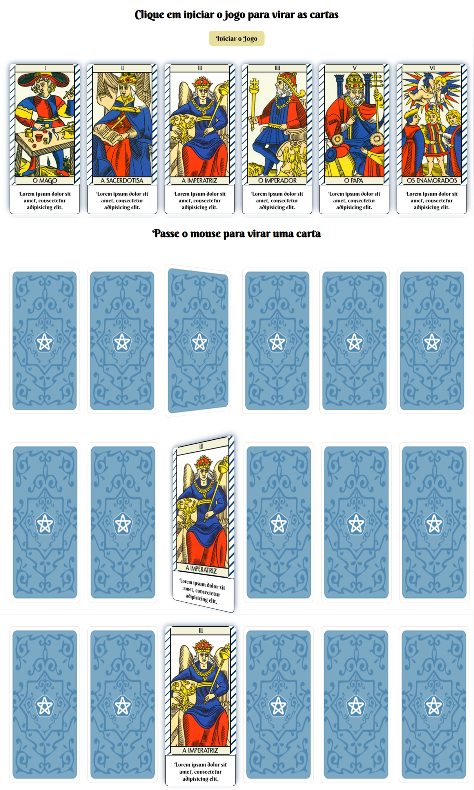

##  <h1 align="center">🃏Jogo de Tarot</h1>

## 📝 Descrição
O projeto final de frontend, consiste em criar um jogo de Tarot, que permita ser sorteada uma carta por vez. Em sua tela inicial seja exibido todas as cartas do arquivo json. Este arquivo json está sendo consumido via http request usando Axios. Ao clicar no botão iniciar o jogo, todas as cartas deverão ser viradas escondendo o seu conteúdo.

[Clique aqui](tarot-sigma-one.vercel.app) para acessar o deploy do projeto

## 🚀 Tecnologias utilizadas
- React js
- styled-components
- axios




## <h2>🔄 Rodando o projeto localmente</h2>  
  
Clone o projeto via HTTPS

```bash
  git clone https://github.com/Personare/front-end-challenge.git
```

Entre no diretório do projeto

```bash
  cd jogo
```

```bash
  npm start
```
